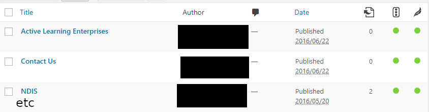
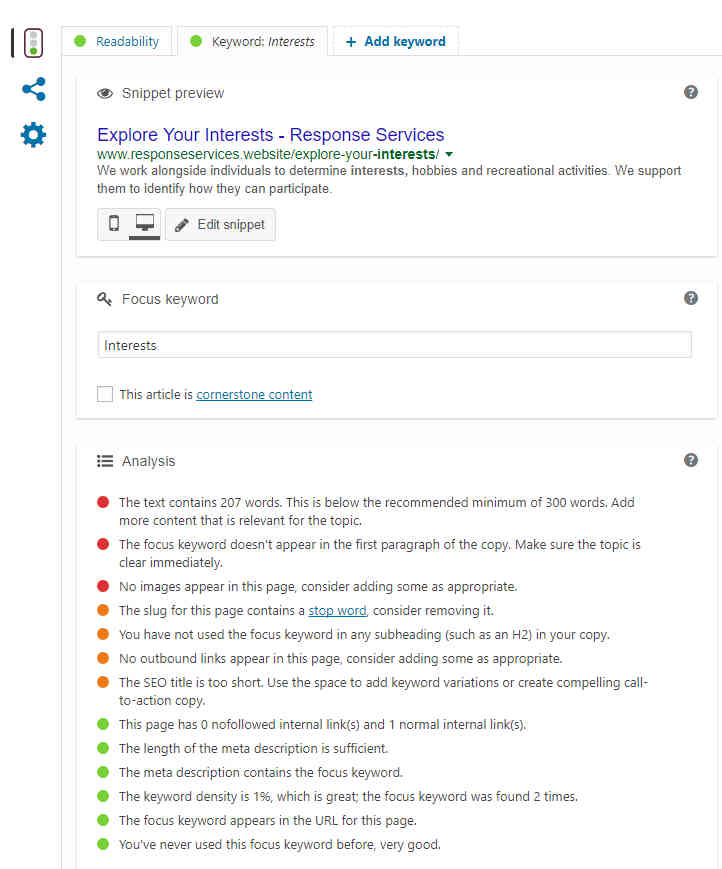
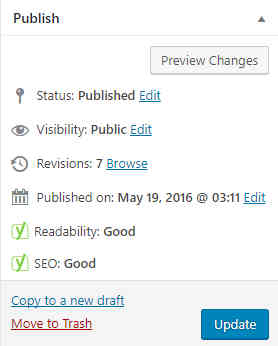
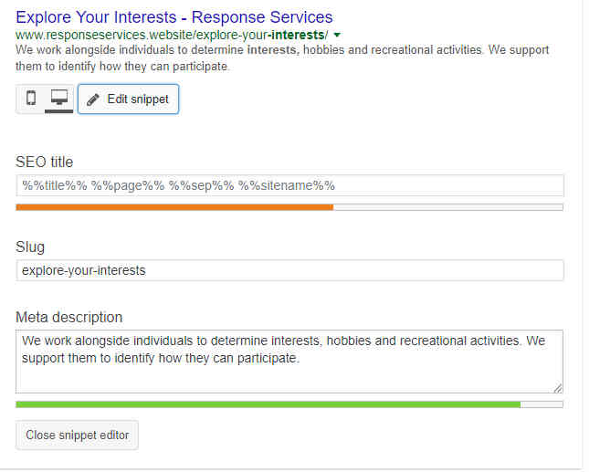

# Search Engine Optimization

## Contents
* [Introduction](#introduction)
* [URLs](#urls)
* [Images](#images)
* [SEO Plug-in](#seo-plug-in)
	* [Readability and Optimization](#readability-and-optimization)
	* [Optimizing Individual Pages](#optimizing-individual-pages)
	* [Readability](#readability)
	* [Optimization](#optimization)
		* [Google Snippet](#google-snippet)
			* [Title](#title)
			* [Relative URL (Slug)](#relative-url-slug)
			* [Meta Description](#meta-description)
		* [Focus Keyword](#focus-keyword)
			* [Keyword Choice](#keyword-choice)
			* [Multiple Keywords](#multiple-keywords)
			* [Cornerstone Content](#cornerstone-content)
		* [Score Criteria](#score-criteria)
	* [Configuration](#configuration)
* [Conclusion](#conclusion)
	* [Further Reading](#further-reading)
* [Disclaimer](#disclaimer)

---

## Introduction
Over the past week, I have been learning about what ‘Search Engine Optimization’ is and applying that theory to the Response Services Incorporated website. I will admit I am no expert at this and I would not be surprised if I left room for improvement. The important thing is that even basic SEO practices would still be better than none at all.

When I first heard of SEO, I came to associate it with manipulating a web page’s HTML code so that the search engine crawlers find more value in it and give a higher ranking in search engine results. To an extent this is true but the difference here is that our site is handled through WordPress. While it is easier to build websites using WordPress, we get less control over the *actual* HTML output. In the long run, I think this is more of a good thing because:

* WordPress is a widely used content management system for both business and personal websites. Therefore, we know it is deemed legitimate by web crawlers.
* The site theme ‘Lawyeria Lite’ prides itself on being clean, responsive, and widely supported by different browsers.

---

## URLs
It is important to ensure that URLs are readable. That way, they are more ‘Search Engine Friendly’.

* **Friendly:** [http://www.example.com/about]()
* **Unfriendly:** [http://www.example.com/p=123]()

To set the link formats for a WordPress site:

* Go to: Settings --> Permalinks
* Select the ‘Post Name’ option instead of ‘Plain’

When editing individual pages, try to ensure that their specific URLs do not have any leading numbers on the end, such as '/who-we-are-3'. This comes back to the idea of making the URL as readable as possible for both humans and crawlers.

---

## Images
When embedding images onto a page, ensure that it has ‘alt text’ which describes what the image is supposed to be. If the image cannot load on the page for whatever reason, this alt text will be displayed instead. Not only this is beneficial for readers, it also helps the search engine crawler gain a better understanding of the page and it's image content. Apparently, this even affects the SEO for Google Images. Therefore, the images themselves will benefit and not just the page.

Here are some examples:

\

This is the Response logo. It's alt text might be “Response Logo” or “Response Services Incorporated Logo”

\
\

This is a picture of a Cat. It's alt text might be “Cat” or “Tabby Cat”.

\
The idea is to have a short, simple description so that readers can tell what the image is supposed to be even when it does not load.

---

## SEO Plug-in
The core functionality of WordPress can be extended by installing community-developed plug-ins. These plug-ins can be anything from personal tweaks to an entire new set of features. As WordPress is more widely used in comparison to G-Suite or Google Apps, it has a larger developer base and hence a larger selection of plug-ins to choose from. With this in mind, its not surprising that WordPress offers plug-ins to support Search Engine Optimization.

For this purpose, I have chosen to use the [Yoast SEO](https://yoast.com/) plugin. I will not describe the process of installing or configuring it. Instead, I will provide links at the end of this document for further reading.

---

### Readability and Optimization
For each page and post on the website, Yoast measures, estimates and tracks it's overall value when it comes to web crawlers. The dimensions used to measure value are Readability’ and ‘Optimization’. Readability indicates how easy it is for a human to read the page. Optimization indicates how easy it is for a search engine crawler to read the page and how likely it is to give the page a fair ranking in search results.

Yoast gives feedback on each dimension using a ‘traffic light’ system. Red is bad, Yellow is okay, and Green is good. The colour Grey means that the score is unknown.

For example:

\

\
It may be difficult to read, but this is a picture of the page management screen for the Response WordPress site. You may notice the Green dots on the far-right for each page.

* The left one refers to Search Engine Optimization and uses a traffic light icon.
* The right one refers to Readability and uses a feather icon.

I have taken care to ensure both dimensions are Green for all pages. If you have to prioritize, it is important to have the SEO score as high as possible with Readability coming second.

---

### Optimizing Individual Pages
When editing an individual page or post, There is a 'Yoast SEO' section towards the bottom of the screen.

\

\
The ‘Publish’ section on the right side of the editor displays the score rating for both dimensions.

\

\
Referring back to the image of the SEO section, you might be able to see that the plug-in will advise you of ways to improve your score with that particular dimension. For example, while the page’s SEO score is already good, the word count is still lower than recommended, has no images, and has no external links.

Next, I will explain how to ‘improve’ Readability.

---

#### Readability

The Readability score indicates how easy it is for a human to read the page.

* Group your text into sections with subheadings (h2, h3, etc).
	* I have found that this does not always affect the score.
	* Try to ensure that the amount of text between each subheading does not exceed 300 words.
* Individual paragraphs should not be longer than 300 words. Otherwise, it will be marked as 'too long'. 
* No more than 25% of all sentences should have more than 20 words.
	* Try to split one longer sentence into multiple shorter sentences.
* At least 30% of all sentences should contain a transition word.
	* Sometimes, I have gotten away with less. Even being somewhere in the 20s can offer a fair boost.
	* This can be a difficult score to attain when editing content but every point counts.
	* The Yoast website includes an [article](https://yoast.com/transition-words-why-and-how-to-use-them/) on transition words and why they are important.
	* Additional sources:
		* [Smart Words](https://www.smart-words.org/linking-words/transition-words.html)
		* [University of Wisconsin](https://writing.wisc.edu/handbook/style/transitions/)
		* [YourDictornary](https://grammar.yourdictionary.com/style-and-usage/list-transition-words.html)
		* [ThoughtCo](https://www.thoughtco.com/list-of-transition-words-1857002)
	* Sentences containing transition words can be highlighted, isolating those without any.
* Less than 10% of all sentences should contain passive voice.
	* Sentences that do contain passive voice can be highlighted.
	* I do not entirely understand this myself. As a rule of thumb, write in present tense instead of past or neutral.
		* **Before - Passive:** “Response runs various services”    
		* **After - Active:** “Response currently runs various services”
* Yoast also scores Readability based on the ‘Flesch Reading Ease’ test.
	* Simply put, scale of how easy it is to read and understand the page from 0 to 100.
	* The lower the index, the more difficult it is to read.
	* Yoast gives the highest score to pages with an index of 60 or greater.
	* I have not found a general formula to improve this score. Shortening and splitting sentences does seem to help.
	* The Yoast website contains an [article](https://yoast.com/flesch-reading-ease-score/#utm_source=wordpress-seo-metabox&utm_medium=inline-help&utm_campaign=readability&utm_term=flesch-reading-ease) explaining the test in further detail.

---

#### Optimization
The Optimization score indicates how well a particular page has been optimized for search engines.

This tab can be split into three parts. The first part is how the page will be displayed as a Google search result. The second part allows you to set a ‘focus keyword’ for the page. The third part is the criteria result list in a similar manner to Readability. Each section will be explained individually to give an idea as to how they collectively affect a page’s optimization score.

---

##### Google Snippet
The first part of the Optimization tab previews the page as a Google result. The result entries displayed with a Google search are referred to as snippets. The snippet contains the page’s display title and description as Google sees it.

To change this display text, click on ‘Edit snippet’. Clicking this button will toggle the display of a set of fields relating to editing the snippet.

\

\
You will see that this set contains three fields relating to the Google snippet. These refer to the title, relative URL, and description respectively.

---

###### Title
This is the header text that will be displayed in the search result. In this case, it is "Explore Your Interests - Response Services". The SEO title follows a syntax specified in the Yoast configuration. The default syntax for this website is "%pageName% - %siteName%"

Normally the default format is sufficient but the score will be improved if the title contains the focus keyword. Unfortunately, this page does not have the focus keyword within it's title. Therefore, it does not gain any extra score.

It is also important to note that in order for this criteria to count, the keyword must be specified manually within the title. Relying on placeholders and syntax alone does not register. Even if the page’s real title does have the focus keyword, which is ‘Interests’, it does not improve the SEO score unless it is specified manually.

---

###### Relative URL (Slug)
The relative URL is the part of the link that refers to a specific page within a website. For example:

* **Absolute:** [http://www.example.com/info/about.html]()
* **Relative:** [/info/about.html]()

The relative URL of a page as displayed by Google is known as the ‘slug’. In this case, it is "explore-your-interests". By default, a page’s slug will be it's existing relative URL. I would recommend leaving this as-is for consistency but as I previously mentioned, it may be a good idea to remove leading or unnecessary numbers. You’re also free to experiment with this and incorporate the focus keyword in order to improve scores.

---

###### Meta Description
This is simply a short description of the page in order to explain what it is about. This is used to grab a user’s attention as they skim through search results. If no meta description is given, it will instead use the page’s first paragraph as-is with no score given. In some cases, this is *okay* but if the paragraph has any inline HTML or CSS, it will be displayed as literal text and wouldn’t look very appealing. With that in mind, I think it is better to write a meta description anyway, even if it is more or less the first paragraph to begin with.

When I wrote the meta descriptions for the Response pages, I would use and condense a few sentences from the opening paragraph. This allows the user a short preview so that they may be tempted to click on the search result and read more. The meta description only allows for a few sentences worth of text. The exact limit is 156 characters as indicated by a coloured progress bar. Yoast gives the best score for meta descriptions with more than 120 characters.

To reiterate, the meta descriptions I wrote are short summaries of the opening paragraph. The table below shows a before and after comparison between the portion I used from the example page and how it was changed to fit the meta description.

| Paragraph | Content                                                                                                                                                                          | Characters |
|-----------|----------------------------------------------------------------------------------------------------------------------------------------------------------------------------------|------------|
| Before    | We work alongside individuals to determine interests, hobbies and recreational activities. Afterwards, we support them to identify how they can participate in these activities. | 176        |
| After     | We work alongside individuals to determine interests, hobbies and recreational activities. We support them to identify how they can participate.                                 | 144        |

Measured with [LetterCount.com](https://www.lettercount.com/)

As with the title and slug, extra credit is given if the meta description incorporates the focus keyword.

---

##### Focus Keyword
The second part of the Optimization tab is much simpler in comparison to the first part. It allows you to specify the focus keyword of the page and whether the page contains 'cornerstone content'. The focus keyword refers to what Google search keyword(s) this page relates to. As far as determining what results to display, Google ranks each known page according to their keywords and how relevant the page is to those particular keywords.

For example, when one wants to google “Microsoft”, the first results will almost certainly relate to the technology company responsible for Windows products. This is because that company’s website has the top rank for the keyword “Microsoft”. On the other hand, if somebody were to create a personal website also named “Microsoft”, they might still be able to obtain a ranking, albeit a very low one. This is because people have come to associate the word “Microsoft” with the company and the search engine’s ranking algorithm favours this accordingly.

Generally when you upload a video to YouTube or post to a blog (including WordPress), you are given the option to specify tags for your post. This is so that when a user enters keywords into a search bar, the results returned will be those tagged with the same or similar keywords. If you like, you can consider the Internet as one giant blog, A single page as an individual post, and Google as the search function. When somebody makes a Google search, chances are they want to access a particular page. Hence, they type keywords into the search bar. Google then sorts through it's massive database of different pages and retrieves them in order of how closely they relate to the desired keywords.

For more information about focus keywords, refer to the [article](https://yoast.com/focus-keyword/) on the Yoast website.

---

###### Keyword Choice
When I chose keywords, I considered ones that relate to the page as a whole, the SEO title, the slug, and the meta description. While having a focus keyword in itself is will improve the score, the improvement will be more significant if this keyword appears in all three snippet components. This may not always be possible but I prioritized the meta description. The SEO score will gain even more improvement if the keyword is:

* Used in subheadings and image alt text
* Used in the first paragraph
* Unique for every page

A keyword does not have to be a literal word. It can be a phrase or a sentence. For example, I used “Active Learning Enterprises” as the focus keyword for the 'Active Learning Enterprises' page.

---

###### Multiple Keywords
There is a small catch with the Yoast SEO plug-in. Like many WordPress plug-ins, there is a basic free version and an upgraded paid version. One of the limitations of the free version is that a page can only have one focus keyword. This may not affect the ranking of a page *too* much but I can see how having multiple keywords would be useful for attaining the highest possible ranking. As shown previously, I used the focus keyword “interests” for the 'Explore Your Interests' page. For me, this was trying to find the right keyword in order to achieve the best SEO score possible. The page still ranks low for “response interests”, “response services interests”, “explore your interests”, etc. If I had the paid version, I could include as many keywords as necessary.

---

###### Cornerstone Content
This refers to website pages with the most important and well-written content. If a page is marked as such, the crawler may take that into consideration when deciding how to rank the website. I have not marked any of the Response pages as cornerstone, but it is something I might do in the future.

When a page is marked as having cornerstone content, Yoast's SEO scoring criteria is a lot more strict. For example, 300 words is sufficient for a good score when writing regular pages. However, with cornerstone content, the target word count is 900. This would make sense for a blog but for a light website, I think this would be excessive and unnecessary.

For more information about cornerstone content, refer to the [article](https://yoast.com/what-is-cornerstone-content/#utm_source=wordpress-seo-metabox&utm_medium=inline-help&utm_campaign=cornerstone-content&utm_content=5.1) on the Yoast website.

---

##### Score Criteria

* Make sure that the page has a complete Google Snippet.
	* I consider the meta description to be the most important.
* Always specify a focus keyword.
	* Bonus if the keyword is only used for one page across the whole site.
	* The keyword should incorporate into the SEO title, slug, and meta description.
	* It should also appear in the first paragraph as well as at least one subheading and image alt text but I do not feel that this is necessary.
	* There is also a criteria for having the keyword in the URL itself but do not force this one.
* Including at least one image on the page will give a small bonus.
	* This can be anything but should relate to the focus keyword in some way.
* Outbound links to different websites also give a small bonus.
* The page’s body text should be at least 300 words.
	* I don’t think this is necessary for every page but it is supposed to be helpful for relevancy and detail.
	* Having around 250 words will still give a good score.
* The keyword density should be around 1-3%
	* The focus keyword should not appear more than a couple of times.
	* I do not know the exact percentage that constitutes as 'too dense'.
* The snippet’s meta description should be 120-155 characters long.
* The snippet’s slug should not contain [stop words](https://en.wikipedia.org/wiki/Stop_word).
* Linking to other pages within the website appears to help.

---

### Configuration
I did not write this document as a tutorial for the Yoast SEO plug-in. Rather, I wrote it as a resource for some practices which can help Search Engine Optimization when writing content. Earlier on when explaining the Google Snippet, I mentioned that by default, the snippet title follows a format which is chosen in Yoast’s configuration. In the end, I simply do not have the knowledge to be able to write a full tutorial for configuring the plug-in.

I found a separate [tutorial](https://www.wpbeginner.com/plugins/how-to-install-and-setup-wordpress-seo-plugin-by-yoast/) that you can read at your own leisure. To skip directly to the section regarding SEO title format, go to step #7.

---

## Conclusion
I wrote this document with the intention of providing a reference to Search Engine Optimization and some advice which may help when writing content in the future. However, do not take my word for any of this. This is by no means qualified information regarding search engine optimization or search engines as a whole. This is only based on my experience and I hope that I could make some improvements regarding how SEO is handled.

If you wish to read more authoritative information, here are links to the resources I used. Otherwise, let me know if there is anything I can do in order to improve the SEO and/or this document.

-Tyrone

---

### Further Reading
* [WordPress SEO - Friendly URL Structure](https://www.wpbeginner.com/wp-tutorials/seo-friendly-url-structure-for-wordpress/)
* [SEO Plug-in Comparison](https://www.wpbeginner.com/opinion/yoast-seo-vs-all-in-one-seo-pack-which-is-the-best-wordpress-seo-plugin/)
* [How Google Search Works](https://developers.google.com/search/docs/beginner/how-search-works?visit_id=1-636371435506845969-2091942644&rd=2)
* [Ultimate WordPress SEO Guide for Beginners](https://www.wpbeginner.com/wordpress-seo/)
* [Boost WordPress SEO](https://techtage.com/31-ways-to-better-wordpress-seo/)
* [Yoast SEO Guide](https://yoast.com/wordpress-seo/)
* [BlueHost SEO Guide](https://www.bluehost.com/blog/tips-tricks-improving-seo-wordpress-website/)
* [Add WordPress site to Google](https://www.wpbeginner.com/beginners-guide/how-to-add-your-wordpress-site-to-google-webmaster-tools/)

---

## Disclaimer
This repository is based on an internal document I wrote as part of the IT team at Response Services Incorporated. I was asked to learn about Search Engine Optimization techniques and apply them as best I can to their WordPress site. I was then asked to compile my research into a document for future reference.

I wrote the original version of this document on 8-9 August 2017. As such, the information in this report is relevant to that time frame and may not be accurate or up-to-date as of present.

The document was converted to markdown on 17 January 2021. Any organization-specific information was removed, or rewritten to fit with the general topic. I also corrected typos, corrected grammar mistakes, and summarized unnecessarily long or redundant text. The revised document was then shared publicly on 19 January 2021.

The original sources for the SEO information have been linked in the [Further Reading](#further-reading) section. All links have been verified as of 17 January 2021. The information I used for this document is the property of its respective legal owners.

The [Response Logo](./images/logo.jpg) belongs to Response Services Incorporated and was used with implicit permission as an employee.

The [Cat](https://commons.wikimedia.org/wiki/File:Tabby_cat_with_blue_eyes-3336579.jpg) image file was retrieved from  Wikimedia Commons on 17 January 2021. The original version of the file came from [Pixabay](https://pixabay.com/photos/cat-blue-eyes-pet-feline-3336579/), which is freely [licensed](https://pixabay.com/service/license/) for both personal and commercial use. This is not the same Cat image I used for the original document. I was uncertain about it's source and the copyright behind it so I replaced it with a 'Creative Commons' image just to be sure.

The [Yoast SEO](https://yoast.com/) plug-in screencaps are my own work and used to explain the plug-in's features.

This document as a whole is licensed under [CC BY-NC-ND 4.0](https://creativecommons.org/licenses/by-nc-nd/4.0/).

